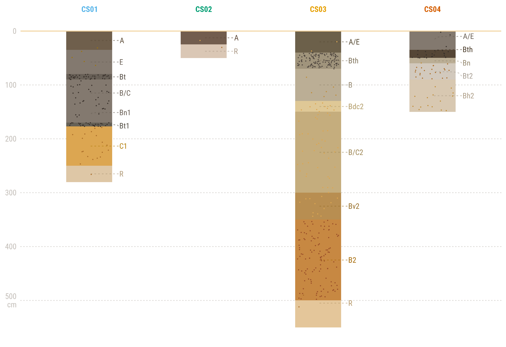

# Happy Soil Day with ggplot2!!
On the ocassion of the soil conservation day, a short contribution to working with soil data posted in Rpubs: [profile visualizations with ggplot2](https://rpubs.com/cmguiob/soilday_0721_profiles).

You can find the complete [R code](https://github.com/cmguiob/POST_SoilDay_R/blob/main/SoilDay_0721_Profiles.R) here.
 
 
